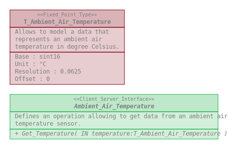

# Physical_Quantities_Interfaces

This repository defines a package gathering software elements allowing to deal
with physical quantities.

## Content

The Physical_Quantities_Interfaces package gathers :
* Types :
  * T_Ambient_Air_Temperature
* Interfaces :
  * Ambient_Air_Temperature

## Overview

## Dependencies

None.

## Use

### With the Arduino IDE

This repository shall be clone within the _librairies_ folder of the _Arduino
sketchbook folder_.